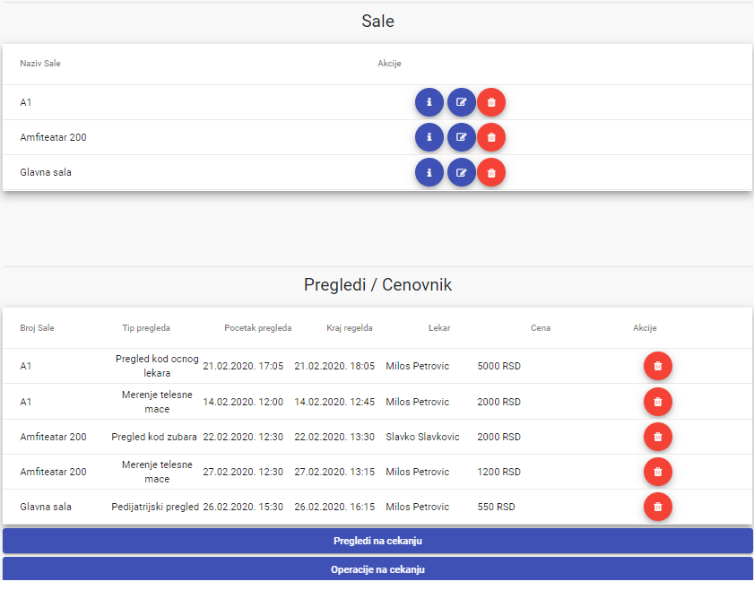
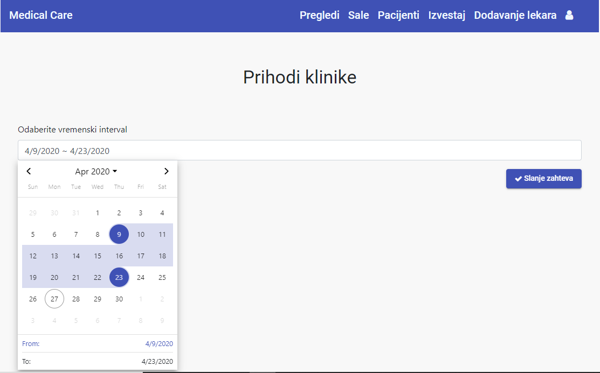
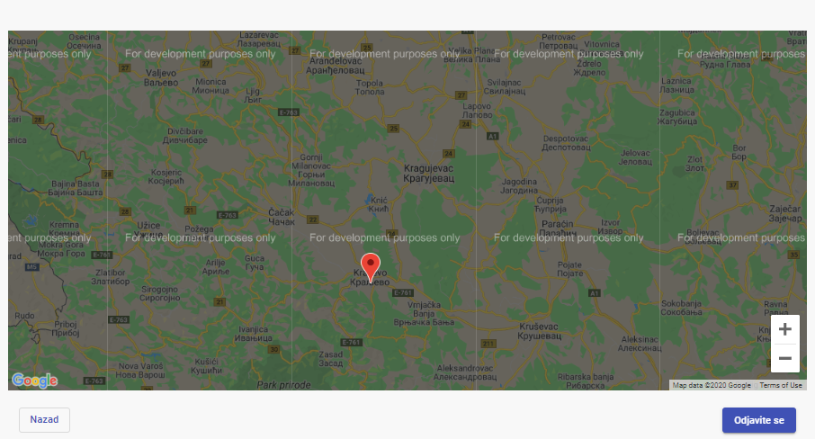

# Medical Care

Tehnologije koriscene u projektu su:
* Java 8
* Spring Boot
* MySQL
* Angular 8

Detaljna specifikacija projekta se nalazi [ovde](PDF/Specifikacija%20projekta.pdf).

---
## Uputstvo za pokretanje projekta
Klijentski deo se pokrece tako sto se otvori direktorijum **medical-care-ng-app**. A zatim, izvrse komande. Front end ce se podici na default portu 4200.

```
    npm install
    
    ng serve
```

Serverski deo aplikacije pokrenuti iz radnog okruzenja. Preporucuje se [Intellij IDE](https://www.jetbrains.com/idea/download/#section=windows). Pre pokretanja aplikacije povuci sve neophodne zavisnosti putem Maven-a. Port serverske aplikacije nakon pokretanja je 8080.

---
## Prikaz nakon logovanja na sistem




Za potrebe geolokacije koriscen je Google API. Po potrebi moguce je naknadno povezati kreditnu karticu sa Google servisom kako bi nestao watermark sa mape.

---
### Autori projekta
* Danica Vuckovic RA 244-2017
* Petar Kovacevic RA 245-2017